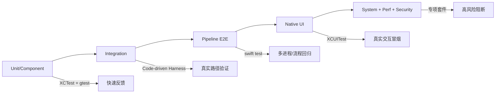

# OWL Browser Architecture

## 全栈分层

```
┌─────────────────────────────────┐
│  SwiftUI Views                  │  owl-client-app/Views/
│  ViewModels                     │  owl-client-app/ViewModels/
│  Services (Swift)               │  owl-client-app/Services/
├─────────────────────────────────┤
│  OWLBridge.framework (C-ABI)    │  bridge/
├─────────────────────────────────┤
│  Mojo IPC                       │  mojom/
├─────────────────────────────────┤
│  ObjC++ Client Components       │  client/
│  (TabManager, InputTranslator)  │
├─────────────────────────────────┤
│  C++ Host Process               │  host/
│  (BrowserImpl, WebContents,     │
│   HistoryService, BookmarkService)│
├─────────────────────────────────┤
│  Chromium Content Layer         │  (upstream)
└─────────────────────────────────┘
```

## 目录职责

| 目录 | 语言 | 构建系统 | 职责 |
|------|------|---------|------|
| `owl-client-app/` | Swift | SPM | SwiftUI 前端 |
| `bridge/` | ObjC++ | GN → framework | C-ABI 桥接层 |
| `client/` | ObjC++ | GN | 客户端组件 |
| `host/` | C++ | GN | Host 子进程 |
| `mojom/` | Mojom IDL | GN | IPC 接口定义 |

## SPM Target 结构

```
OWLBrowserLib (library)     → Views + ViewModels + Services
OWLBrowser (executable)     → @main 入口，依赖 OWLBrowserLib
OWLTestKit (library)        → 共享测试工具，依赖 OWLBrowserLib
OWLUITest (executable)      → CGEvent 系统级测试
OWLBrowserTests (test)      → Pipeline 集成测试（需 Host）
OWLUnitTests (test)         → ViewModel 单元测试（不需 Host）
OWLIntegrationTests (test)  → 跨层集成测试（真实 C-ABI → Mojo → Host → Renderer）
```

## 数据流

新增全栈功能的典型路径：

1. **Mojom** — 定义 IPC 接口（`mojom/*.mojom`）
2. **Host C++** — 实现服务逻辑（`host/owl_*.cc`）
3. **Bridge C-ABI** — 暴露 C 函数（`bridge/owl_bridge_api.h`）
4. **Swift Service** — 封装异步调用（`Services/*.swift`）
5. **ViewModel** — 状态管理 + MockConfig（`ViewModels/*.swift`）
6. **SwiftUI View** — UI 展示（`Views/*.swift`）

参考实现：BookmarkService（已完成）、HistoryService（已完成）

## 测试架构建议（对齐 Arc 风格，非迁移前提）

本项目采用“先自有代码验证，再接管浏览器层验证”的测试能力布局：

- Swift 业务逻辑层（单元/组件）: `OWLUnitTests` 与 `owl-client-app/Tests/Unit/*`
- Swift 跨层集成（含桥接）：`OWLIntegrationTests` 与 `owl-client-app/scripts/harness`
- Swift + Host 关键链路（pipeline）：`OWLBrowserTests`（`pipeline`）
- 原生 UI：`owl-client-app/UITests/*` 与 `owl-client-app/UITest/*`（签名与 CI 稳定性仍在完善）
- 系统输入测试：`OWLUITest`
- C++ 核心逻辑：`host/*`、`bridge/*`、`mojom/*` 下的 gtest/单测目标

该布局与 Arc 风格的“分层测试”一致，但不要求引入固定框架（例如 TCA）：  
优先在每条数据流上建立“状态变更可解释”和“跨层真实调用可观测”这两条能力。

### 建议的测试分层映射



### 当前可直接复用的工程化能力

- 观测型跨层测试产物：`owl-client-app/scripts/harness_*` 系列产物（`harness_summary.json`、`harness_metrics.json`、`harness_playbook.md` 等）
- Flaky/健康门禁：`check_flake_trend.py` 与 maintenance 周期化治理
- 用例覆盖追踪：`check_harness_quality.py` 与 `check_docs_consistency.py`
- 质量基线：`check_harness_maintenance.py` 输出长期治理任务与历史趋势

与测试实践对应的长期学习项见：[TESTING-LEARNINGS.md](TESTING-LEARNINGS.md)。
