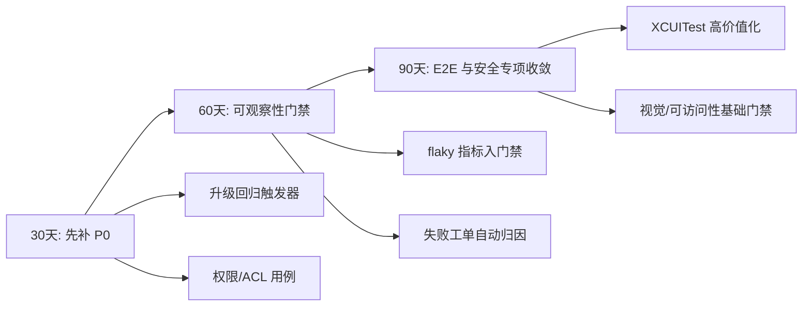

# OWL Testing Learnings

## 来源说明

本文件提炼自公开可验证资料与 `/Users/xiaoyang/Downloads/deep-research-report.md` 的高价值结论。所有非 OWL 事实部分采用“可替代方案”方式记录，不作为 Arc 内部实现的直接断言。

## 可直接借鉴的三条主线

### 1) 分层优先、风险驱动

- 先把测试分为：
  - 单元/组件（确定性高）
  - 集成（跨模块状态一致性）
  - E2E/UI（关键用户流）
  - 视觉/可访问性/性能/安全（高价值专项）
- 对每条功能先定义风险等级：
  - P0：安全/权限/同步数据相关
  - P1：核心任务流（导航、会话、下载）
  - P2：体验与回归（视觉、可访问性、交互）
- 在 OWL 当前结构中，第一阶段优先落实 P0/P1。

### 2) 失败可解释性是主轴，不是测试数量

- 每类失败都要有可复用资料：日志、截图/录像、trace、控制台。
- 将失败归因拆开：
  - 代码路径导致
  - 基础设施导致（runner、网络、系统权限）
  - 环境偶发（资源不足、超时）
- 维护 `flaky` 与 quarantine 清单，给出自动解禁期限。

### 3) 升级窗口即回归窗口

- Arc 类浏览器产品天然高依赖 Chromium 升级，必须把升级窗口绑定到专项回归：
  - Web 平台 smoke 套件
  - 与上层关键功能联动（同步/导航/权限）
- OWL 已有脚本化能力，推荐加入“升级触发清单”而不是靠人工记忆。

## 与 OWL 当前建设的映射

### 已覆盖（可直接对齐）

- unit/component：`OWLUnitTests`、`run_tests.sh unit`
- integration：`OWLIntegrationTests` + harness policy
- pipeline/e2e：`OWLBrowserTests` + `run_tests.sh pipeline`
- 原生 UI：`owl-client-app/UITests/*`、`run_tests.sh xcuitest`
- 观测治理：`check_flake_trend.py`、`run_harness_maintenance*`

### 待补齐（按优先级）

- P0：Chromium 升级专项回归触发器（与 release notes/版本窗口绑定）
- P0：安全高危面（权限模型、ACL、注入面）用例闭环
- P1：XCUITest 统一收敛到 3-5 个高价值冒烟，并减少外网依赖
- P1：将 `flaky` 指标显式纳入 PR Gate 与 release-gate 档位
- P2：视觉/可访问性基础化指标门禁（初期低门槛先行）

## 版本提交建议（用于你提到的“项目较大”场景）

建议上传到 GitHub 的内容按“稳定性与可复现性”分组：

1. 核心文档（必上传）
   - `docs/ARCHITECTURE.md`
   - `docs/TESTING.md`
   - `docs/TESTING-ROADMAP.md`
   - `docs/TESTING-LEARNINGS.md`
   - `docs/harness-openai-alignment-2026-04-09.md`（若已有）

2. 可执行规则与脚本（必上传）
   - `owl-client-app/scripts/run_tests.sh`
   - `owl-client-app/scripts/*.sh`
   - `owl-client-app/scripts/*.py`
   - `docs/harness-openai-alignment-2026-04-09.md`

3. 测试资产（按规模分批）
   - 先提交 `owl-client-app/Tests`、`owl-client-app/UITests`、`docs/testing-harness-coverage-*.md`
   - 再补 `host/*_test.cc`、`bridge/*_unittest.mm`、`mojom/*` 的配套用例

4. 过滤项
   - 不上传 build 产物、签名中间件、编译缓存和本地历史文件（由 `.gitignore` 与 `.github-export-ignore` 管控）

## 执行手册（30/60/90）

## 当前优先建议（最终可直接执行）

- 立即执行：在 `run_tests.sh` 与 `harness_policy.json` 中固化 P0/P1 门禁。
- 1 周执行：补齐 `TESTING-ROADMAP.md` 中 P1 表项，形成固定周报。
- 2 周执行：补齐 `TESTING-LEARNINGS.md` 的风险闭环记录和维护动作。
